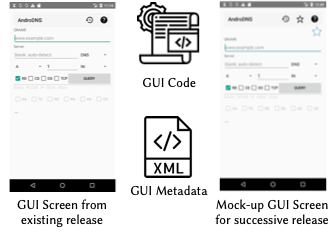
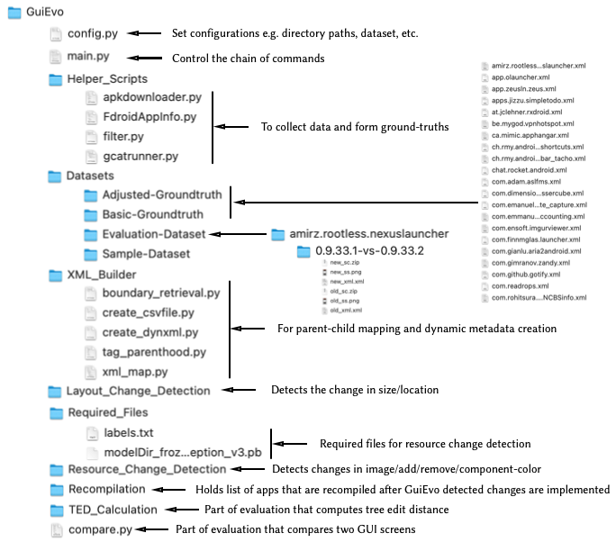

<h2 align="center"> GuiEvo: Automated Evolution of Mobile App GUIs from Mockups </h2>

## Overview
This repository holds the replication package for GuiEvo that includes two parts that are discussed in details in following sections: 
- Part1: Evaluation dataset for GuiEvo
- Part2: Source code and setup instructions of GuiEvo

## Part1: Evaluation Dataset for GuiEvo
To implement GuiEvo, we gathered 987 apps from F-Droid [1]. However, we considered 119 apps based on source code availability on GitHub and at least 1000 downloads on Google Play store. We filtered 23 apps from this list through a meticulous observation where GUI changes were visually noticeable. We took a pair of successive Android packages from each app and executed CrahScope [2] on each of them to capture GUI screens and GUI metadata. For GUIEvo, a single data point is comprised of four parts – (i) GUI metadata, (ii) GUI screen, and (iii) GUI source code, and (iv) the mock-up design for the new version of the app.
<p align="center"> </p>

## Part2: Source code and setup instructions of GuiEvo
### Source Code Directory
<p align="center"> </p>

### GuiEvo Setup
**NOTE**: Following instructions for installing GuiEvo are based on M1 Mac.

To setup and run AidUI, following steps need to be done.
#### Clone GuiEvo
Clone this repositry by using the ```git clone``` command. If git is not already installed, please follow the installation instructions provided [here](https://git-scm.com/downloads).
#### Install Anaconda
To install Anaconda, please follow the [link](https://www.anaconda.com/)
#### Install TensorFlow
To install TensorFlow, please follow the [link](https://www.tensorflow.org/). Installed Anaconda comes with a default conda envirionment _"base"_. Install TensorFlow within a created virtual environment. 

#### Run GuiEvo
- Move to the root directory of GuiEvo
- Execute the following command to run GuiEvo: 
```bash
python3 main.py
```

## References
1. https://f-droid.org/, F-droid.
2. K. Moran, M. Linares-V ́asquez, C. Bernal-C ́ardenas, C. Vendome, and D. Poshyvanyk. Crashscope: A practical tool for automated testing of android applications. In Proceedings of the 39th International Conference on Software Engineering Companion, ICSE-C ’17, page 15–18. IEEE Press, 2017.
