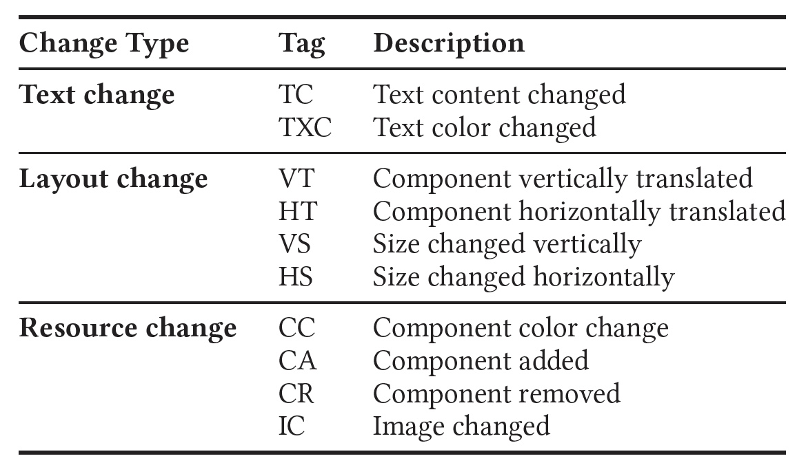

<h2 align="center"> GuiEvo: Automated Evolution of Mobile Application GUIs </h2>

<!--[](https://doi.org/10.5281/zenodo.7644966) [](https://opensource.org/licenses/Apache-2.0)-->

## Overview
GuiEvo identifies changes in the properties of GUI elements extracted from the existing GUI screen and mock-up GUI screen. We focus on three main categories of GUI changes- (i) Text Changes, (ii) Layout Changes, and (iii) Resource Changes. These categories are adapted from prior work on GUI change recognition in mobile apps [1], serving as a scaffolding for our analysis and exploration of GUI modifications. Subcategories under these classes are mentioned in the following table and few examples of the change types in the following image. 

<p float="left" align="center">


</p>

Every identified change in the GUI is automatically incorporated into the GUI metadata to generate an updated representation for the mock-up GUI screen. Subsequently, these changes are integrated into the GUI code.

This repository contains the replication package of our **GuiEvo** project. This replication package includes two main parts which we discuss in details in later sections:
- Part1: Source code and setup instructions of GuiEvo
- Part2: Datasets for GuiEvo

## Part1: Source code and setup instructions of GuiEvo
We developed a completely automated approach designed to produce updated GUI metadata by implementing identified GUI changes between consecutive app releases.

<p align="center"> </p>

The architecture of GuiEvo, is designed around three major phases as illustrated in the Figure above: (i) Visual GUI Understanding, (ii) GUI Change Classification, and (iii) GUI Change Implementation. GuiEvo explores the GUI and GUI metadata of an app’s existing release from associated GitHub repository, studies the mock-up design for the new release, and automatically detects perceptual image differences by identifying added, removed or recurrent components. This process provides a visual understanding of the GUI changes for a single screen with a corresponding mock-up selected by the developer. GuiEvo then crops out identified affected component areas and tags each component with the type of changes during automated GUI change classification. Then GuiEvo automatically generates a dynamic xml tree that reflects the components on the mock-up design of the GUI, and finally implement the classified changes into the GUI code of the existing release. We developed GuiEvo for facilitating software developers with a fully automated generation of GUI metadata and modified GUI code during the evolution of an app. It is written in Python and implemented for the Android platform. Developers solely need to execute GuiEvo by providing it with the GUI screen, metadata and code from the existing release and the mock-up GUI design for the new release. GuiEvo would then automatically generate GUI metadata for the mock-up design and a new modified version of the GUI code is availed by implementing the changes in the GUI code, either manually or automatically using GPT-4 prompts.

We set up the directory structure of the project to closely follow the architecture of the tool presented above. The following subsections present the directory structure of the source code of GuiEvo as well as the instructions to set it up.


### GuiEvo Directory structure
```bash
├── GuiEvo
│   ├── XML_Builder 
│   │   ├── builds parent-child mapping for the GUI components  
|   |
│   ├── Detection --> detects GUI changes between app releases
│   │   ├── layout change detection
│   │   ├── text change detection
│   │   ├── resource change detection
|   |
│   ├── Evaluation --> module to evaluate the prerformance of GuiEvo (both manual and GPT) and baseline approaches [2-3]
│   │   ├── comparison with GuiEvo
│   │   ├── comparison with GPT
│   │   ├── comparison with ReDraw
│   │   ├── comparison with REMAUI
│   │   
│   ├── Evaluation-Dataset --> holds screenshots, XML metadata and source code for 22 apps
│   │   ├── 22 application packages
│   │   │   ├── screenshot from existing release
│   │   │   ├── screenshot from upcoming release (mock-up GUI)
│   │   │   ├── XML metadata from existing release
│   │   │   ├── XML metadata from upcoming release (serves as groundtruth for the generated UI hierarchy)
│   │   │   ├── source code from the existing release (serves as the base for code modification phase)
|   |
│   ├── Metadata --> holds data that is generated during the process of GuiEvo
│   │   ├── cropped GUI components from existing release
│   │   ├── identified new GUI components from mock-up GUI
│   │   ├── generated updated UI hierarchy
│   ├
```

### Install and Run GuiEvo

<!--**NOTE**: ***Our provided instructions for installing GuiEvo are currently only applicable to macOS Ventura 13.5.1 with Apple M1 chip (although other recent versions of macOS should be fine), due to the required specific Anaconda and TensorFlow packages. As such, these instructions will likely not work on Windows or mcOS.*** -->

To setup and run GuiEvo, following steps need to be done.

1. #### Clone GuiEvo
Clone this repository by using the ```git clone``` command. If git is not already installed, please follow the installation instructions provided [here](https://git-scm.com/downloads).

2. #### Install Anaconda
To install Anaconda, please follow the instructions at this [link](https://www.anaconda.com/). We ran GuiEvo on Anaconda version 4.12.0

3. #### Setup the conda environments
Installed Anaconda comes with a default conda environment _"base"_. We can check the available environments using the following command:
```bash
conda info --envs
```

4. #### Setup TensorFlow
GuiEvo utilizes TensorFlow version 2.8.0 within the _"base"_ environment. Please follow the installation instructions provided [here](https://www.tensorflow.org/install) to setup TensorFlow.

5. #### Run GuiEvo
- Move to the root directory of GuiEvo

- Execute the following command to run GuiEvo
```bash
python3 main.py
```
- The process usually takes around 20~30 minutes to complete (based on our experience on macOS Ventura 13.5.1 with Apple M1 chip).


## Part 2: Datasets for GuiEvo
For its processing, GuiEvo requires – (i) GUI metadata, (ii) GUI screen, and (iii) GUI source code for the old release ; and (iv) the mock-up design for the new version of the app. These four elements altogether forms a single data point. To construct the evaluation dataset for assessing GuiEvo’s performance, we curated data by cross-referencing F-Droid, a recognized software repository for open-source Android applications with the content available on the Google Play store. From a list of 987 apps from F-Droid, we considered 119 apps based on source code availability on GitHub and at least 1000 downloads on Google Play store. From there, we collected 1048 Android packages from 119 Android apps, resulting in the capture of 49,466 pairs of screens and GUI metadata across all available versions. For evaluation purposes,
we randomly selected one pair of consecutive versions from each app and thoroughly examined the corresponding UI screens. However, not all app screens exhibited noticeable GUI changes, and for some, the UI hierarchy did not align with the GUI components. Following a meticulous exploration, we selected a total of 22 apps, collecting 22 pairs of GUI and GUI metadata for both old and new releases.

## References
1. Kevin Moran, Cody Watson, John Hoskins, George Purnell, and Denys Poshyvanyk. 2018. Detecting and Summarizing GUI Changes in Evolving Mobile Apps. In Proceedings of the 33rd ACM/IEEE International Conference on Automated Software Engineering (Montpellier, France) (ASE 2018). Association for Computing Machinery, New York, NY, USA, 543–553. https://doi.org/10.1145/3238147.3238203
2. Kevin Moran, Carlos Bernal-Cárdenas, Michael Curcio, Richard Bonett, and Denys Poshyvanyk. 2018. Machine Learning-Based Prototyping of Graphical
User Interfaces for Mobile Apps. IEEE Transactions on Software Engineering PP (02 2018). https://doi.org/10.1109/TSE.2018.2844788
3. Tuan Anh Nguyen and Christoph Csallner. 2015. Reverse Engineering Mobile Application User Interfaces with REMAUI (T). In 2015 30th IEEE/ACM International Conference on Automated Software Engineering (ASE). 248–259. https://doi.org/10.1109/ASE.2015.32
